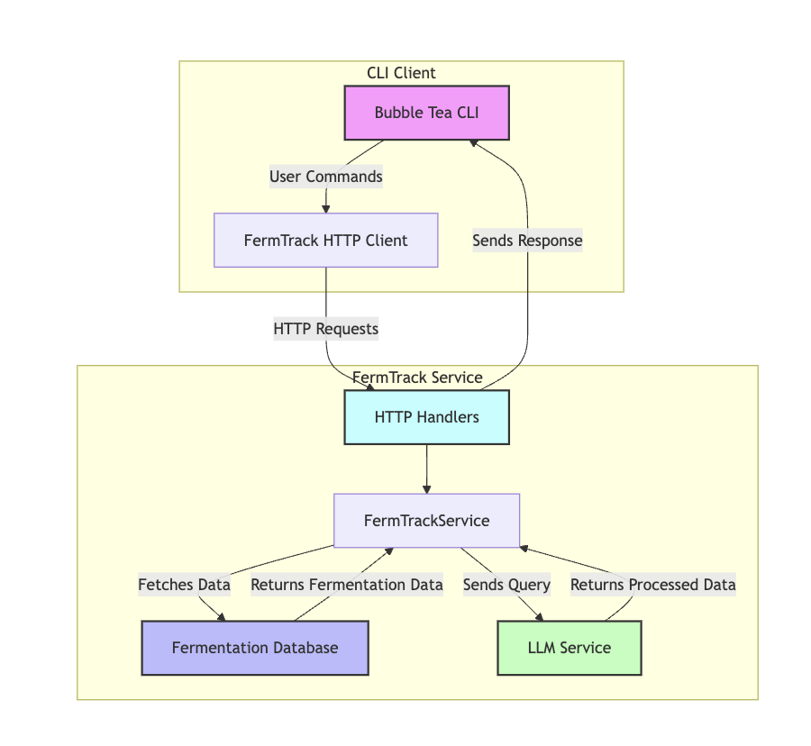

# fermtrack

## What is this

This is a prototype of a larger system I wanted to make for myself to help track my different home wine projects.

* View past and current wine projects
* Get personalized advice from an LLM based on past project notes

The main user interface is a terminal UI powered by [bubbletea](https://github.com/charmbracelet/bubbletea). It's a wee rough but fine for a prototype.

Future plans:
* Ability to enter in measurements (SG, PH, etc) for each projects and view in time series graph
* Reminders of when to proceed/measure with a certain project
* Better UI


## How to Run locally

This requires go >= 1.22

### 1. Set up the fermtrack server

To get full functionality, you will need a chat gpt key. Create a `.env` file at the root and specify the key there. This will work without the key, but the functionality will be limited.

.env example
```
CHATGPT_KEY=
JWT_SECRET_KEY=anystring
```

To run, simply run main directly and build and run.
```
% go mod vendor
% make start
```
 
To stop
```
% make stop
```

To view logs
```
% make logs
```


Create a user locally by starting the server and running the following (substituting the username/pass as you like):

```
curl -X POST http://localhost:8080/v1/users \
  -H "Content-Type: application/json" \
  -d '{
    "username": "cooluser",
    "password": "cool123"
  }'
```


### 2. Running the TUI

```
% cd cli
% go build ; ./cli
```

All operations require a login to work. Create a user/pass through the curl (described above).

The current main supported commands:
```
	help		Get a list of commands
	list		List current winemaking projects
	view 	    View specific project notes
	edit 	    Edit specific project notes # UNSUPPORTED
	clear		Clear screen and any selections
	login		Login to the system
	Or simply ask the wine wizard anything you like! [Requires Chat GPT Key]
```

### Migrations

Migrations are by goose and will run upon server startup automatically.

```
% brew install goose # or follow instructions here: https://github.com/pressly/goose
% GOOSE_DRIVER=mysql GOOSE_MIGRATION_DIR=migrations goose create <desc> sql

```

### System diagram




### Links I find useful

https://platform.openai.com/docs/guides/prompt-engineering/tactic-provide-examples

https://github.com/sashabaranov/go-openai

https://platform.openai.com/usage

https://charm.sh/blog/commands-in-bubbletea/

